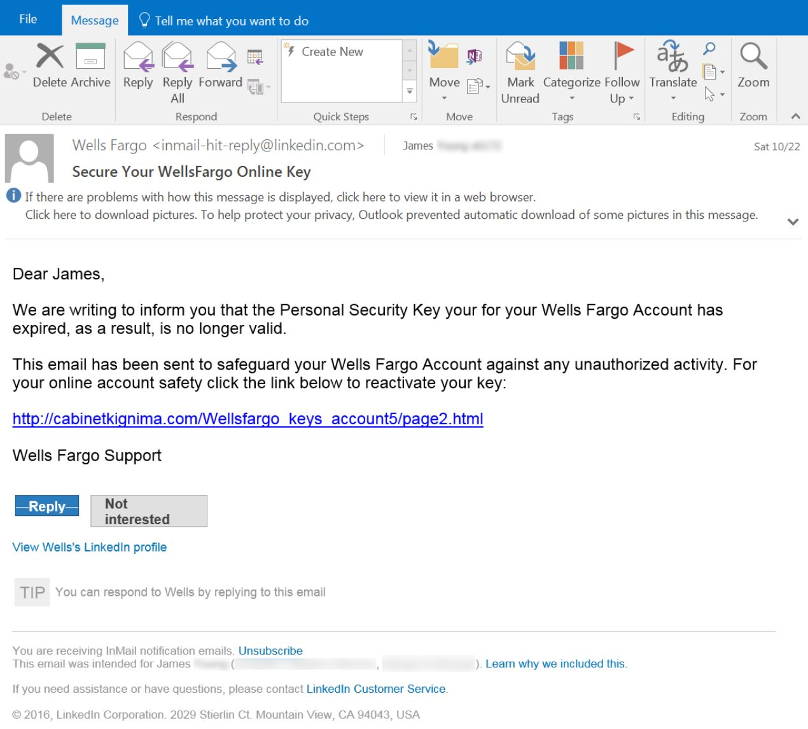
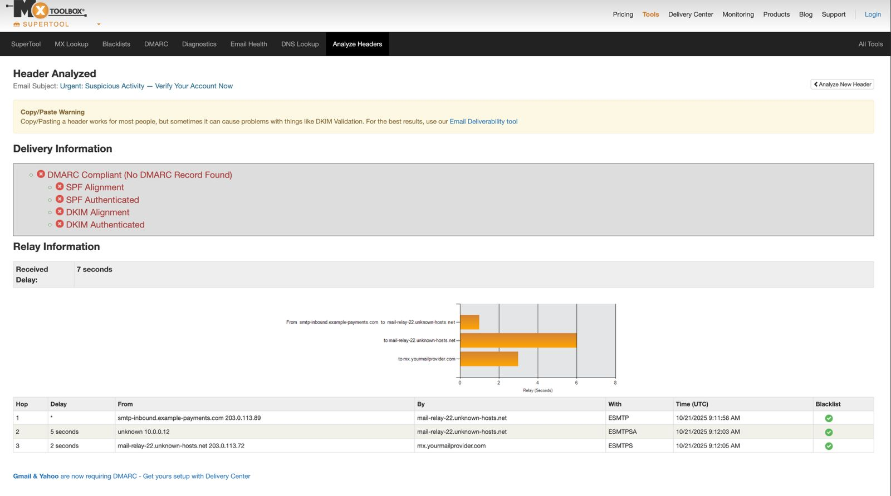

# Phishing Email Analysis

This repository contains a detailed analysis of a phishing email incident. It includes:

- A PDF report with comprehensive details ([Phishing-Email-Analysis.pdf](./Phishing-Email-Analysis.pdf))
- Two supporting evidence images:
  - 
  - 

## Contents
- **Phishing-Email-Analysis.pdf** – Full analysis and explanation
- **/images/** – Folder with supporting screenshots

## About
This project is aimed at showcasing methods for identifying and analyzing phishing emails, highlighting:
- Social engineering techniques
- Email header forensics
- Phishing indicators in suspicious messages
- Evidence gathering and reporting

---

Feel free to explore and use these resources for learning or training purposes.
